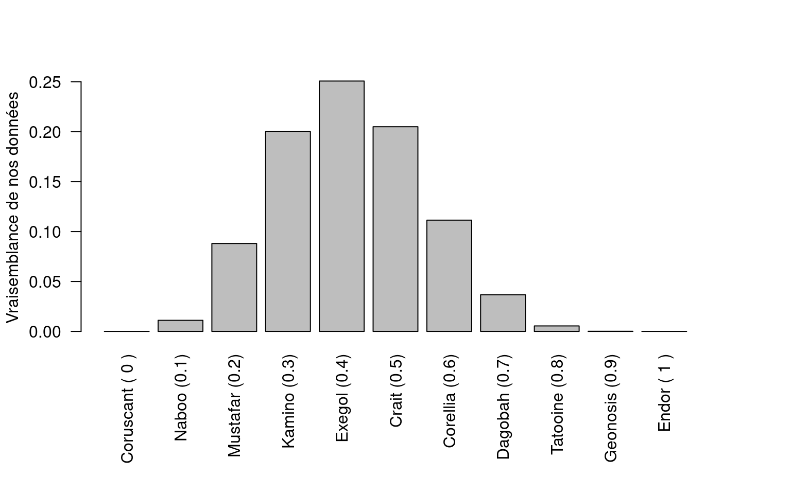

### Un atterrissage forcé

Suite à un problème technique, notre navette spatiale doit s'arrêter en urgence sur la planète la plus proche. Un rapide examen de l'ordinateur de bord indique que c'est le système de localisation qui est tombé en panne. Malheureusement, c'est impossible de repartir sans lui. Nous sommes cloués au sol, sans savoir sur quelle planète nous venons d'atterrir.

Notre capitaine de bord n'est pas trop inquiet, il s'empresse d'appeler l'assistance remorquage spatial qui viendra, sans aucun doute, nous chercher d'ici quelques jours au plus tard. Mais sa confiance retombe vite : l'assistance lui demande le nom de la planète sur laquelle nous nous trouvons, sans quoi elle ne pourra jamais réussir à nous localiser.

Nous sommes bel et bien coincés ici.

### Des roses rouges, des roses blanches

C'est alors que la botaniste de l'équipe a une idée. Il existe sur chaque planète de la galaxie une espèce de rose rouge, mais dont certaines fleurs sont entièrement blanches. Ce qui est intéressant, c'est que chaque planète possède une proportion de fleurs blanches qui lui est propre.

En botaniste confirmée, notre coéquipière promène toujours dans son sac un gros livre sur les plantes à fleurs de la galaxie. Et dans son livre est inscrite la liste de toutes les planètes du système avec pour chacune d'entre elles la proportion de fleurs blanches chez notre espèce de rose.

### Nos données : un bouquet de roses !

Le plan est le suivant : nous allons récolter un échantillon aléatoire de 10 roses et compter le nombre de fleurs blanches parmi les rouges. Nous obtenons ainsi 6 roses rouges et 4 roses blanches. Ces chiffres, ce sont nos données. Pour faciliter le traitement de l'information nous utilisons l'ordinateur de bord qui, comme dans tous les vaisseaux spatiaux, est équipé du logiciel $\textsf{R}$.

Voici comment nous rentrons les données :

``` r
white = 4
total = 10
```

### Notre théorie : serions-nous sur Tatooine ?

Notre capitaine de bord, sûr de lui, émet une théorie selon laquelle nous serions arrivés sur la planète Tatooine. Selon le livre des plantes de la galaxie, Tatooine possède une proportion de fleurs blanches de `O.8`.

On entre cette théorie dans $\textsf{R}$ de la façon suivante :

``` r
Tatooine = 0.8
```

Il nous faut maintenant déterminer si les données sont vraissemblables selon cette théorie.

### La vraisemblance de nos données

Ici, la vraisemblance (en anglais on dit "likelihood") de nos données, c'est la probabilité d'avoir récolté un échantillon semblable au notre, en considérant que nous sommes effectivement sur Tatooine, où la proportion de fleurs blanches est de `0.8`.

Autrement dit, on peut se poser la question : si nous sommes sur Tatooine, à quel point est-ce probable d'avoir récolté 4 fleurs blanches sur un total de 10 fleurs récoltées ?

Ça tombe bien, dans $\textsf{R}$, c'est très facile de calculer cette probabilité. Il suffit d'utiliser la fonction `dbinom()` !

``` r
likelihood = dbinom(
  x    = white,    # 4
  size = total,    # 10
  prob = Tatooine  # 0.8
)
```

On peut désormais connaitre la probabilité d'avoir récolté 4 fleurs blanches sur 10 si nous sommes sur Tatooine !

``` r
print(likelihood)
```

    [1] 0.005505024

Aye ! La vraissemblance est toute petite : peine 0.6 % de chance ! Cela signifie que si nous sommes sur Tatooine, ça serait très improbable d'avoir récolté un échantillon comme le notre !

### D'autres théories

Ne nous avouons pas vaincus ! Même si nos données ne sont pas vraisemblables avec notre première théorie, nous avons plein d'autres théories à tester. Rappelez-vous, grâce au livre de botanique, nous connaissons les proportions de fleurs blanches pour chaque planète de la galaxie.

Commençons par rentrer dans $\textsf{R}$ chacune des planètes de la liste et la proportion de fleurs blanches associée :

``` r
Coruscant = 0
Naboo     = 0.1
Mustafar  = 0.2
Kamino    = 0.3
Exegol    = 0.4
Crait     = 0.5
Corellia  = 0.6
Dagobah   = 0.7
Tatooine  = 0.8
Geonosis  = 0.9
Endor     = 1
```

Elles sont classées de celle qui a la plus petite proportion de fleurs blanches (Coruscant n'a aucune fleur blanche) à celle qui a la plus grande proportion de fleurs blanches (Endor n'a que des fleurs blanches). Au total, nous avons 11 planètes, soit 11 théories possibles.

Nous allons de nouveau utiliser la fonction `dbinom()` pour calculer la vraisemblance de nos données selon chacune des théories.

Pour éviter de calculer les vraisemblances une à une, dans $\textsf{R}$, on va créer un vecteur pour grouper toutes les théories :

``` r
theories = c(
  Coruscant,
  Naboo,
  Mustafar,
  Kamino,
  Exegol,
  Crait,
  Corellia,
  Dagobah,
  Tatooine,
  Geonosis,
  Endor
)
```

Nous avons désormais une suite de valeurs représentant nos 11 théories :

``` r
print(theories)
```

     [1] 0.0 0.1 0.2 0.3 0.4 0.5 0.6 0.7 0.8 0.9 1.0

### Alors ? Où sommes nous ?

Il ne nous reste qu'à calculer les vraisemblances pour toutes les théories :

``` r
likelihoods = dbinom(
  x    = white,    # 4
  size = total,    # 10
  prob = theories  # de 0 à 1
)
```

Le résultat est une suite de vraisemblances. Chaque valeur représente la probabilité de récolter un échantillon comme le notre (de 4 fleurs blanches sur 10 fleurs récoltées) en fonction de la planète sur laquelle on se trouve. Plus la probabilité est grande, plus on a de chance que notre échantillon soit issu de la planète.

``` r
print(round(likelihoods, 2))
```

     [1] 0.00 0.01 0.09 0.20 0.25 0.21 0.11 0.04 0.01 0.00 0.00

Bon, pour y voir plus clair, faisons un graphique !



Avec ce graphique on voit bien que la probabilité d'avoir récolté un échantillon de roses semblable au nôtre est la plus élevée si nous sommes sur Exegol. Nous pouvons donner cette information à l'assistance remorquage spatial ! On peut également leur transmettre l'information que la probabilité d'avoir un échantillon semblable au notre est assez élevée sur Kamino et Crait. Par contre la vraissemblance de nos données selon la théorie que l'on soit sur Coruscant ou Endor est nulle. Pas la peine que l'assistance nous cherche sur ces deux planètes !
