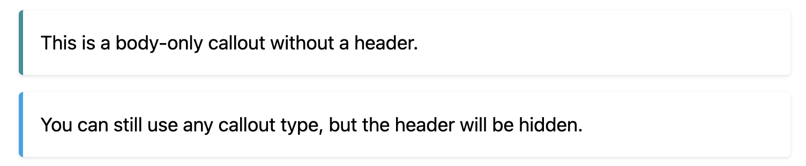
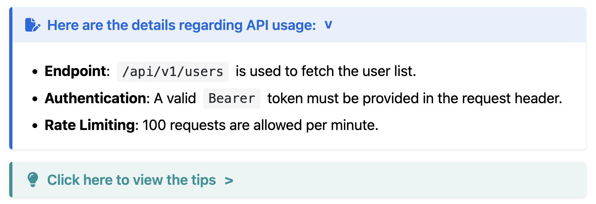
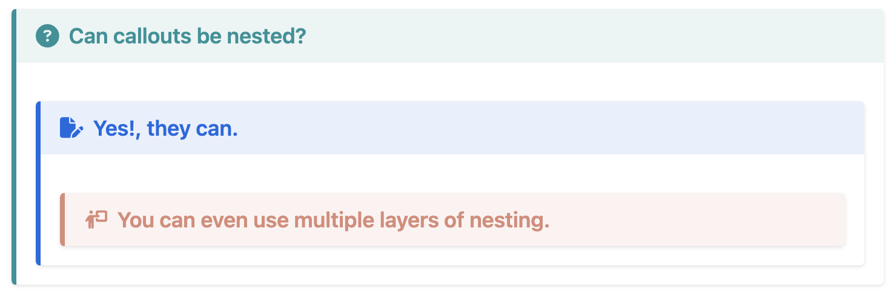

# Hugo-admonitions

[](https://deepwiki.com/KKKZOZ/hugo-admonitions)

A lightweight Hugo module that adds beautiful and customizable admonition blocks to your content.

Inspiration from [mdbook-admonish](https://tommilligan.github.io/mdbook-admonish/).

> [!IMPORTANT]
> The minimum required Hugo version is `0.140.0`. If you find that features work correctly locally but not on your deployed GitHub Pages site (e.g., admonition colors are wrong), the most likely reason is that the `HUGO_VERSION` specified in your GitHub Actions workflow file (usually under `.github/workflows/`) is lower than `0.140.0`.

If you find this project useful, please consider giving it a star! ⭐

## Table of Contents

- [Hugo-admonitions](#hugo-admonitions)
  - [Table of Contents](#table-of-contents)
  - [Features ✨](#features-)
  - [Overview of all admonitions](#overview-of-all-admonitions)
    - [Light Mode](#light-mode)
    - [Dark Mode](#dark-mode)
    - [Header Only Mode](#header-only-mode)
    - [Headless Mode](#headless-mode)
    - [Foldable Admonitions](#foldable-admonitions)
    - [Nested Admonitions](#nested-admonitions)
  - [Installation](#installation)
    - [Hugo Module](#hugo-module)
    - [Git Clone](#git-clone)
  - [Usage](#usage)
  - [Customization](#customization)
    - [Variable Overrides (Recommended)](#variable-overrides-recommended)
      - [Global Theme Colors](#global-theme-colors)
      - [Admonition Type Base Colors](#admonition-type-base-colors)
      - [Header Text \& Icon Colors (Per-Type Override)](#header-text--icon-colors-per-type-override)
    - [Dark Mode Support](#dark-mode-support)
    - [Advanced SCSS Override (Modifying Rendering Logic)](#advanced-scss-override-modifying-rendering-logic)
  - [Contributing](#contributing)
  - [License](#license)
  - [Star History](#star-history)

## Features ✨

- Various beautiful and simple callout available 🎨
- Blockquote style 💬
  - Portable Markdown style (GitHub, Obsidian, Typora, etc.) 📝

  - ```md
    > [!WARNING]
    > Warning: This operation will delete all data.
    ```

- Dark Mode Support 🌙
- Header Only Mode 📑
- Headless Mode 🧩
- Foldable Admonitions 📂
- Multi-language Support 🌐
  - English
  - Chinese (Simplified)
  - Chinese (Traditional)
  - Czech
  - French
  - German
  - Korean
  - Polish
  - Portuguese
  - Swahili
  - [Localization PRs are always welcome!](https://github.com/KKKZOZ/hugo-admonitions/pulls)

## Overview of all admonitions

### Light Mode


### Dark Mode


### Header Only Mode

<div align="center">
  
</div>

### Headless Mode

Body-only callouts without a header. 



### Foldable Admonitions



### Nested Admonitions



## Installation

> [!IMPORTANT]
> This modules requires Hugo `v0.140.0` or later.

### Hugo Module

1. Install the [Go programming language](https://go.dev/doc/install).

2. Initialize your own hugo module:

    ```shell
    hugo mod init YOUR_OWN_GIT_REPOSITORY
    ```

3. Add `hugo-admonitions` in your site's configuration file:

    With `hugo.yaml`:

    ```yaml
    module:
      imports:
        - path: github.com/KKKZOZ/hugo-admonitions
        - path: my-theme
    ```

    With `hugo.toml`:

    ```toml
    [module]
      [[module.imports]]
        path = "github.com/KKKZOZ/hugo-admonitions"
      [[module.imports]]
        path = "my-theme"
    ```

4. Finally update by running:

    ```shell
    hugo mod get -u
    ```

### Git Clone

1. Inside the folder of your Hugo site, run:

    ```bash
    git clone git@github.com:KKKZOZ/hugo-admonitions.git themes/hugo-admonitions --depth=1
    ```

2. Add `hugo-admonitions` as the left-most element of the theme list variable in your site's or theme's configuration file `hugo.yaml` or `hugo.toml`.

    With `hugo.yaml`:

    ```yaml
    theme: ["hugo-admonitions", "my-theme"]
    ```

    With `hugo.toml`:

    ```toml
    theme = ["hugo-admonitions", "my-theme"]
    ```

## Usage

See [demo.md](docs/content/demo.md) for examples.

Use the blockquote in this way:

```markdown
> [!NOTIFY]
> System notification: Your password will expire in 30 days.
```


<!-- <details>
<summary>Available Callouts List</summary>

- `[!ABSTRACT]`
- `[!CAUTION]`
- `[!CODE]`
- `[!CONCLUSION]`
- `[!DANGER]`
- `[!ERROR]`
- `[!EXAMPLE]`
- `[!EXPERIMENT]`
- `[!GOAL]`
- `[!IDEA]`
- `[!IMPORTANT]`
- `[!INFO]`
- `[!MEMO]`
- `[!NOTE]`
- `[!NOTIFY]`
- `[!QUESTION]`
- `[!QUOTE]`
- `[!SUCCESS]`
- `[!TASK]`
- `[!TIP]`
- `[!WARNING]`

</details> -->

<details>
<summary>Available Callouts List</summary>

| Alerts & Emphasis | Information & Elaboration | Guidance & Interaction |
|-------------------|---------------------------|------------------------|
| `[!DANGER]`       | `[!INFO]`                 | `[!TIP]`               |
| `[!ERROR]`        | `[!NOTE]`                 | `[!TASK]`              |
| `[!WARNING]`      | `[!ABSTRACT]`             | `[!GOAL]`              |
| `[!CAUTION]`      | `[!CONCLUSION]`           | `[!IDEA]`              |
| `[!IMPORTANT]`    | `[!EXAMPLE]`              | `[!QUESTION]`          |
| `[!SUCCESS]`      | `[!QUOTE]`                | `[!NOTIFY]`            |
|                   | `[!CODE]`                 |                        |
|                   | `[!EXPERIMENT]`           |                        |
|                   | `[!MEMO]`                 |                        |

</details>

<br/>

> [!NOTE]
> Unsupported callout types will default to `[!NOTE]`

Or you can customize the title by using any of them:

```markdown
> [!IDEA] Summary
> This is a summary using the `IDEA` callout!
```


```markdown
> [!MEMO] Summary
> This is a summary using the `MEMO` callout!
```


Use the Header Only mode by including a title only:

```markdown
> [!TIP] You can choose to only to show the header!

> [!NOTIFY] System notification: Your password will expire in 30 days

> [!SUCCESS] Congratulations! Your code has been successfully deployed to production

> [!WARNING] Warning: This operation will delete all data. 
```


Use the Headless mode by setting an empty title (double or single quotes):

```markdown
> [!TIP] ""
> This is a body-only callout without a header.

> [!INFO] ''
> You can still use any callout type, but the header will be hidden.
```


Use the [extended syntax](https://gohugo.io/render-hooks/blockquotes/#extended-syntax):

```markdown
> [!TIP]- Click here to view the tips

> [!TIP]+ Click here to view the tips
```


You can use nested admonitions too:

```markdown
> [!QUESTION] Can admonitions be nested?
> > [!TODO] Yes!, they can.
> > > [!EXAMPLE]  You can even use multiple layers of nesting.
```


## Customization

There are two main ways to customize the styles:

1. **Variable Overrides (Recommended for most users):** Modify colors, opacities, dark mode selectors, etc., by overriding SASS variables. **This method is update-friendly.**
2. **Advanced SCSS Override:** For deep changes to the styling logic and CSS rules, you can override the main SCSS file.

### Variable Overrides (Recommended)

This is the simplest and most common way to customize admonition styles. You only need to create a single SASS file in your project to specify your custom variable values.

1. **Create the user settings SASS file:**

In your Hugo project's **root** directory, create the following file (including the directories if they don't exist): `assets/sass/vendors/_admonitions-user-settings.scss`

You can use these commands from the root of your project:

```shell
mkdir -p assets/sass/vendors
touch assets/sass/vendors/_admonitions-user-settings.scss
```

The resulting directory structure in your project will look like this:

```text
your-hugo-project/
└── assets/
    └── sass/
        └── vendors/
            └── _admonitions-user-settings.scss  <-- Your custom settings file
```

2. **Define your custom variables in this file**

Open `assets/sass/vendors/_admonitions-user-settings.scss` and add your SASS variable overrides.

> [This file](https://github.com/KKKZOZ/hugo-admonitions/blob/main/assets/sass/vendors/_admonitions-user-settings.scss) contains a minimal example to get you started.

> [!IMPORTANT]
> **Do not use `!default`** in this file for your overrides. Your definitions here will automatically take precedence over the module's defaults.

In `_admonitions-user-settings.scss`, you have several levels of customization available:

#### Global Theme Colors

You can override the general colors for all admonitions in both light and dark modes. These variables control the background, text, and code block colors.

```scss
// assets/sass/vendors/_admonitions-user-settings.scss

// --- Theme Colors ---
// Define the colors used for admonition elements in both light and dark modes.

// Light Mode Colors
$admonition-light-bg: #ffffff;                 // Content background
$admonition-light-text: #000000;                // Content text
$admonition-light-code-bg: #f5f5f5;             // Inline code & code block background
$admonition-light-code-text: #24292e;           // Inline code & code block text
$admonition-light-blockquote-border: #e0e0e0;  // Blockquote left border

// Dark Mode Colors
$admonition-dark-bg: #1d1e20;                   // Content background
$admonition-dark-text: #e6e6e6;                 // Content text
$admonition-dark-code-bg: #313244;              // Inline code & code block background
$admonition-dark-code-text: #cdd6f4;            // Inline code & code block text
$admonition-dark-blockquote-border: #45475a;   // Blockquote left border

// --- Header Background Opacity ---
// Controls the opacity of the background color tint applied to the whole admonition block.
// Value should be between 0 (transparent) and 1 (opaque).
$admonition-light-header-bg-opacity: 0.1;       // Opacity for light mode background tint
$admonition-dark-header-bg-opacity: 0.1;        // Opacity for dark mode background tint
```

#### Admonition Type Base Colors

To change the base color for specific admonition types (e.g., `note`, `tip`, `warning`), define the `$admonition-colors-overrides` SASS map. This color is used for the left border and as a base for the tinted background. It also serves as the default color for the header text and icon.

This map will be merged with the module's default type colors, with your definitions taking precedence.

```scss
// Example: assets/sass/vendors/_admonitions-user-settings.scss

// --- Admonition Type Base Colors ---
// Override the default color for specific admonition types.
$admonition-colors-overrides: (
  note: #007bff,      // Make 'note' admonitions blue
  tip: #28a745,       // Make 'tip' admonitions green
  warning: #ffc107,   // Make 'warning' admonitions yellow
  danger: #dc3545
);
```

The default types and their base colors can be found in the `$admonition-colors-base` map within the module's main `_admonitions.scss` file.

#### Header Text & Icon Colors (Per-Type Override)

For more granular control, you can specifically override the header text and icon color for different admonition types in both light and dark modes. This is useful when the base color (from `$admonition-colors` or your override) doesn't provide enough contrast with the tinted background.

Define your overrides in the `$admonition-light-header-text-overrides` and `$admonition-dark-header-text-overrides` maps.

```scss
// Example: assets/sass/vendors/_admonitions-user-settings.scss

// --- Header Text & Icon Color Overrides ---
// Use these maps to set a specific header text color for certain admonition types,
// overriding the default behavior.

$admonition-light-header-text-overrides: (
  // In light mode, the yellow 'warning' admonition base color (#ffc107)
  // is too light for text. Let's make the header text darker for better readability.
  warning: #a37100
);

$admonition-dark-header-text-overrides: (
  // In dark mode, the default header text for 'danger' might be its base color (#dc3545),
  // which can be hard to read on a dark tinted background. We can brighten it up.
  danger: #ff9e8f,
  // Let's also make the 'note' header text white in dark mode for high contrast.
  note: #ffffff
);
```

### Dark Mode Support

By default, `hugo-admonitions` attempts to automatically detect and apply dark mode styling to match your website's theme.

**How it Works:**

Instead of relying on the operating system's preference (`prefers-color-scheme`), this module checks for the presence of specific CSS selectors on your `<html>` or `<body>` tags. The default configuration looks for a wide range of common selectors used by popular Hugo themes and CSS frameworks:

- `html[data-theme="dark"]`, `body[data-theme="dark"]`
- `html[data-bs-theme="dark"]`
- `html[data-scheme="dark"]`, `body[data-scheme="dark"]`
- `html[data-color-mode="dark"]`, `body[data-color-mode="dark"]`
- `body.dark`, `body.dark-mode`, `body.theme-dark`
- `html.dark`, `html.dark-mode`

This list is defined by the `$admonition-dark-selector` variable within the module's SCSS file.

**When Customization is Needed:**

If your theme uses a *different* CSS class or data attribute not included in the default list above, the admonition blocks might remain in light mode even when your site switches to dark mode.

**How to Customize the Dark Mode Trigger:**

You can easily tell `hugo-admonitions` which selector(s) your theme uses by overriding the `$admonition-dark-selector` SCSS variable in `_admonitions-user-settings.scss`.

> [!NOTE]
> If you encounter difficulties getting dark mode to work correctly with your specific theme, even after following these steps, or if anything in this guide is unclear, please don't hesitate to **open an [issue](https://github.com/KKKZOZ/hugo-admonitions/issues/new)**!

### Advanced SCSS Override (Modifying Rendering Logic)

If you need to make more fundamental changes to the admonition styles beyond what variables allow (e.g., altering CSS rules for structure, spacing, animations, or adding entirely new CSS), you will need to override the main `_admonitions.scss` file from the module.

> [!CAUTION]
> You will be responsible for merging any upstream changes from the module's `_admonitions.scss` into your overridden copy if you want to receive bug fixes or new SCSS features from the module.

1. **Create a copy of the module's main SCSS file:**
    In your Hugo project's root directory, create the following file:
    `assets/sass/vendors/_admonitions.scss`

    You can use these commands:

    ```shell
    mkdir -p assets/sass/vendors
    touch assets/sass/vendors/_admonitions.scss
    ```

    The resulting directory structure in your project:

    ```text
    your-hugo-project/
    └── assets/
        └── sass/
            └── vendors/
                └── _admonitions.scss  <-- Your overridden main SCSS file
    ```

2. Copy the contents of the [source file] into the file you created.
3. Update the styles as needed.

[source file]: https://github.com/KKKZOZ/hugo-admonitions/blob/main/assets/sass/vendors/_admonitions.scss

## Contributing

Contributions are welcome! Please feel free to submit a [Pull Request](https://github.com/KKKZOZ/hugo-admonitions/pulls).

Before you submit a pull request, please ensure that you have run `npm install`. This will install a husky hook that automatically checks if your commit messages adhere to the [Conventional Commits](https://www.conventionalcommits.org/en/v1.0.0/) specification. Commit messages that do not meet this standard will not pass the automated checks for pull requests.

## License

This project is licensed under the MIT License - see the [LICENSE](LICENSE) file for details

## Star History

<a href="https://www.star-history.com/#KKKZOZ/hugo-admonitions&Date">
 <picture>
   <source media="(prefers-color-scheme: dark)" srcset="https://api.star-history.com/svg?repos=KKKZOZ/hugo-admonitions&type=Date&theme=dark" />
   <source media="(prefers-color-scheme: light)" srcset="https://api.star-history.com/svg?repos=KKKZOZ/hugo-admonitions&type=Date" />
   
 </picture>
</a>
